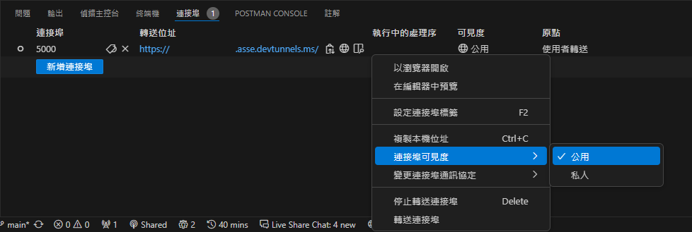

# Food Ordering

## 前置作業
### 複製 Repository
```bash
git clone https://github.com/bruh0422/Food-Ordering.git
cd Food-Ordering
```

### 安裝必要檔案
```bash
pip install -r requirements.txt
```

### 選擇連接埠
在 `.env` 檔案中的 `port=` 後方填入要使用的連接埠。

### 建立機器人
1. 進入 [Line Developer](https://developers.line.biz/console/) 網站，如果尚未登入，網站會引導你登入；若是初次使用，請先填寫基本資料。

2. 若無 Provider，先建立一個 Provider。

3. 選取「Create a new channel」或「Create a Messaging API channel」，填寫機器人資料。

4. 到「Basic settings」頁面將「Channel secret」貼到 .env 檔案的 `channel_secret=` 後方。
5. 到「Messaging API」頁面點擊「Channel access token」下方的「issue」按鈕生成一個 token 並將其貼到貼到 .env 檔案的 `channel_access_token=` 後方。

### 使用 Visual Studio Code 內建功能轉送本機埠
1. 安裝 [Visual Studio Code](https://code.visualstudio.com/)，使用它開啟複製下來的 Repository 後。
2. 按下 `Crtl+J` 快捷鍵呼叫出控制台，選擇「連接埠」選項，按下「轉送連接埠」，填入當初在 `.env` 檔案中填入的 `port` 後按下 `Enter`，將「可見度」設為「公用」。

3. 將轉送位置複製下來，貼上至 `.env` 檔案中的 `root_url=` 後方。
4. 進入剛剛建立的機器人中的「Messaging API」頁面，點擊「Webhook URL」下方的「Edit」按鈕，將轉送位置貼上並在後方加入 `/callback` (你的網址應該會長得像 `https://example.com/callback`)，完成後點擊「Update」，並將下方的「Use webhook」開關打開。

### 新增機器人好友
掃描「Messaging API」頁面中的 QR code 就可以將機器人加入好友。

## 開始使用
```bash
python run.py
```

## 機器人運作流程
### 使用者執行流程


### 程式執行流程
